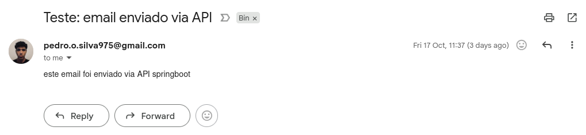

# Email Service API

API desenvolvida em Spring Boot para envio de e-mails de contato. Projetada para ser utilizada como microserviço de notificações por e-mail.

## Índice

- [Tecnologias](#tecnologias)
- [Requisitos](#requisitos)
- [Configuração](#configuração)
- [Execução Local](#execução-local)
- [Documentação da API](#documentação-da-api)

## Tecnologias

- Java 17
- Spring Boot 3.5.6
- Spring Mail
- Maven 3.x

## Requisitos

- JDK 17 ou superior
- Maven 3.6+ (ou use o wrapper `./mvnw`)
- Servidor SMTP configurado

## Configuração

### Variáveis de Ambiente Necessárias

O arquivo `application.properties` padrão não contém todas as configurações necessárias. Você deve configurar as seguintes propriedades:

#### Desenvolvimento (application-dev.properties)

```properties
spring.mail.host=smtp.seu-servidor.com
spring.mail.port=587
spring.mail.username=seu-usuario@dominio.com
spring.mail.password=sua-senha-segura
spring.mail.properties.mail.smtp.auth=true
spring.mail.properties.mail.smtp.starttls.enable=true
spring.mail.properties.mail.smtp.starttls.required=true
spring.mail.properties.mail.smtp.ssl.enable=false
spring.mail.properties.mail.smtp.ssl.trust=*

server.port=5009

# CORS - ajuste conforme necessário
app.cors.allowed-origins=http://localhost:3000,http://localhost:5007
```

#### Produção (application-prod.properties)

```properties
spring.mail.host=mail.seu-dominio.com
spring.mail.port=587
spring.mail.username=noreply@seu-dominio.com
spring.mail.password=${MAIL_PASSWORD}
spring.mail.properties.mail.smtp.auth=true
spring.mail.properties.mail.smtp.starttls.enable=true
spring.mail.properties.mail.smtp.starttls.required=true
spring.mail.properties.mail.smtp.ssl.enable=false
spring.mail.properties.mail.smtp.ssl.trust=*

server.port=5009

app.cors.allowed-origins=https://seu-dominio.com,https://www.seu-dominio.com
```

**Importante:** Nunca versione credenciais sensíveis. Utilize variáveis de ambiente ou um gerenciador de secrets.

## Execução Local

### 1. Clone o repositório

```bash
git clone https://github.com/SilvaOrdep/email-service.git
cd email-service
```

### 2. Configure as propriedades

Crie ou edite o arquivo `src/main/resources/application-dev.properties` com suas credenciais SMTP.

### 3. Execute a aplicação

```bash
# Usando Maven wrapper
./mvnw spring-boot:run -Dspring-boot.run.profiles=dev

# Ou usando Maven instalado
mvn spring-boot:run -Dspring-boot.run.profiles=dev
```

A API estará disponível em `http://localhost:5009`

## Documentação da API

### Endpoint: Enviar E-mail de Contato

**URL:** `POST /api/v1/contact`

**Content-Type:** `application/json`

#### Request Body

```json
{
  "recipient": "destinatario@exemplo.com",
  "subject": "Assunto do e-mail",
  "message": "Corpo da mensagem que será enviada por e-mail."
}
```

#### Campos

| Campo     | Tipo   | Obrigatório | Validação     | Descrição                          |
| --------- | ------ | ----------- | ------------- | ---------------------------------- |
| recipient | string | Sim         | E-mail válido | Endereço de e-mail do destinatário |
| subject   | string | Sim         | Não vazio     | Assunto do e-mail                  |
| message   | string | Sim         | Não vazio     | Conteúdo da mensagem               |

#### Respostas

**Sucesso (200 OK)**

```json
"Email sent successfully"
```

**Erro de Validação (400 Bad Request)**

```json
"An error occurred while trying to send a contact request: [mensagem de erro]"
```

### Exemplo de Uso

```bash
curl -X POST http://localhost:5009/api/v1/contact \
  -H "Content-Type: application/json" \
  -d '{
    "recipient": "contato@exemplo.com",
    "subject": "Teste: email enviado via API",
    "message": "este email foi enviado via API springboot"
  }'
```

#### Exemplo de Resposta

Ao enviar a requisição acima com sucesso, o destinatário receberá um e-mail como o exemplo abaixo:



**Estrutura do e-mail recebido:**

- **De:** noreply@seu-dominio.com
- **Para:** contato@exemplo.com
- **Assunto:** Teste: email enviado via API
- **Corpo:** este email foi enviado via API springboot

## Autor

Pedro Silva (SilvaOrdep)

## Suporte

Para reportar problemas ou solicitar funcionalidades, abra uma issue no repositório GitHub.
